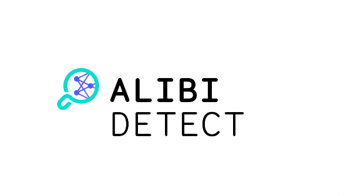

<p align="center">
  
</p>

[](https://github.com/SeldonIO/alibi-detect/actions?query=workflow%3A%22CI%22)
[](https://docs.seldon.io/projects/alibi-detect/en/latest/?badge=latest)

[](https://badge.fury.io/py/alibi-detect)

[](http://seldondev.slack.com/messages/alibi)
---

[Alibi Detect](https://github.com/SeldonIO/alibi-detect) is an open source Python library focused on outlier, adversarial and drift detection. The package aims to cover both online and offline detectors for tabular data, text, images and time series. The outlier detection methods should allow the user to identify global, contextual and collective outliers.

*  [Documentation](https://docs.seldon.io/projects/alibi-detect/en/latest/)

For more background on the importance of monitoring outliers and distributions in a production setting, check out [this talk](https://slideslive.com/38931758/monitoring-and-explainability-of-models-in-production?ref=speaker-37384-latest) from the *Challenges in Deploying and Monitoring Machine Learning Systems* ICML 2020 workshop, based on the paper [Monitoring and explainability of models in production](https://arxiv.org/abs/2007.06299) and referencing Alibi Detect.

## Table of Contents


* [Installation and Usage](#installation-and-usage)
* [Supported Algorithms](#supported-algorithms)
  * [Outlier Detection](#outlier-detection)
  * [Adversarial Detection](#adversarial-detection)
  * [Drift Detection](#drift-detection)
  * [Reference List](#reference-list)
* [Datasets](#datasets)
  * [Sequential Data and Time Series](#sequential-data-and-time-series)
  * [Images](#images)
  * [Tabular](#tabular)
* [Models](#models)
* [Integrations](#integrations)
* [Dependencies](#dependencies)
* [Citations](#citations)


## Installation and Usage

alibi-detect can be installed from [PyPI](https://pypi.org/project/alibi-detect):
```bash
pip install alibi-detect
```

We will use the [VAE outlier detector](https://docs.seldon.io/projects/alibi-detect/en/latest/methods/vae.html) to illustrate the API.

```python
from alibi_detect.od import OutlierVAE
from alibi_detect.utils.saving import save_detector, load_detector

# initialize and fit detector
od = OutlierVAE(threshold=0.1, encoder_net=encoder_net, decoder_net=decoder_net, latent_dim=1024)
od.fit(X_train)

# make predictions
preds = od.predict(X_test)

# save and load detectors
filepath = './my_detector/'
save_detector(od, filepath)
od = load_detector(filepath)
```

The predictions are returned in a dictionary with as keys `meta` and `data`. `meta` contains the detector's metadata while `data` is in itself a dictionary with the actual predictions. It contains the outlier, adversarial or drift scores as well as the predictions whether instances are e.g. outliers or not. The exact details can vary slightly from method to method, so we encourage the reader to become familiar with the [types of algorithms supported](https://docs.seldon.io/projects/alibi-detect/en/latest/overview/algorithms.html).

The save and load functionality for the [Prophet time series outlier detector](https://docs.seldon.io/projects/alibi-detect/en/latest/methods/prophet.html) is currently experiencing [issues in Python 3.6](https://github.com/facebook/prophet/issues/1361) but works in Python 3.7.

## Supported Algorithms

The following tables show the advised use cases for each algorithm. The column *Feature Level* indicates whether the detection can be done at the feature level, e.g. per pixel for an image. Check the [algorithm reference list](#reference-list) for more information with links to the documentation and original papers as well as examples for each of the detectors.

### Outlier Detection

| Detector              | Tabular | Image | Time Series | Text  | Categorical Features | Online | Feature Level |
| :---                  |  :---:  | :---: |   :---:     | :---: |   :---:              | :---:  | :---:         |
| Isolation Forest      | ✔       | ✘     |  ✘          |  ✘    |  ✔                   |  ✘     |  ✘            |
| Mahalanobis Distance  | ✔       | ✘     |  ✘          |  ✘    |  ✔                   |  ✔     |  ✘            |
| AE                    | ✔       | ✔     |  ✘          |  ✘    |  ✘                   |  ✘     |  ✔            |
| VAE                   | ✔       | ✔     |  ✘          |  ✘    |  ✘                   |  ✘     |  ✔            |
| AEGMM                 | ✔       | ✔     |  ✘          |  ✘    |  ✘                   |  ✘     |  ✘            |
| VAEGMM                | ✔       | ✔     |  ✘          |  ✘    |  ✘                   |  ✘     |  ✘            |
| Likelihood Ratios     | ✔       | ✔     |  ✔          |  ✘    |  ✔                   |  ✘     |  ✔            |
| Prophet               | ✘       | ✘     |  ✔          |  ✘    |  ✘                   |  ✘     |  ✘            |
| Spectral Residual     | ✘       | ✘     |  ✔          |  ✘    |  ✘                   |  ✔     |  ✔            |
| Seq2Seq               | ✘       | ✘     |  ✔          |  ✘    |  ✘                   |  ✘     |  ✔            |

### Adversarial Detection

| Detector           | Tabular | Image | Time Series | Text  | Categorical Features | Online | Feature Level |
| :---               |  :---:  | :---: |   :---:     | :---: |   :---:              | :---:  | :---:         |
| Adversarial AE     | ✔       | ✔     |  ✘          |  ✘    |  ✘                   |  ✘     |  ✘            |
| Model distillation | ✔       | ✔     |  ✔          |  ✔    |  ✔                   |  ✘     |  ✘            |


### Drift Detection

| Detector                 | Tabular | Image | Time Series | Text  | Categorical Features | Online | Feature Level |
| :---                     |  :---:  | :---: |   :---:     | :---: |   :---:              | :---:  | :---:         |
| Kolmogorov-Smirnov       | ✔       | ✔     |  ✘          |  ✔    |  ✔                   |  ✔     |  ✔            |
| Maximum Mean Discrepancy | ✔       | ✔     |  ✘          |  ✔    |  ✔                   |  ✘     |  ✘            |


### Reference List

#### Outlier Detection

- [Isolation Forest](https://docs.seldon.io/projects/alibi-detect/en/latest/methods/iforest.html) ([FT Liu et al., 2008](https://cs.nju.edu.cn/zhouzh/zhouzh.files/publication/icdm08b.pdf))
   - Example: [Network Intrusion](https://docs.seldon.io/projects/alibi-detect/en/latest/examples/od_if_kddcup.html)

- [Mahalanobis Distance](https://docs.seldon.io/projects/alibi-detect/en/latest/methods/mahalanobis.html) ([Mahalanobis, 1936](https://insa.nic.in/writereaddata/UpLoadedFiles/PINSA/Vol02_1936_1_Art05.pdf))
   - Example: [Network Intrusion](https://docs.seldon.io/projects/alibi-detect/en/latest/examples/od_mahalanobis_kddcup.html)

- [Auto-Encoder (AE)](https://docs.seldon.io/projects/alibi-detect/en/latest/methods/ae.html)
   - Example: [CIFAR10](https://docs.seldon.io/projects/alibi-detect/en/latest/examples/od_ae_cifar10.html)

- [Variational Auto-Encoder (VAE)](https://docs.seldon.io/projects/alibi-detect/en/latest/methods/vae.html) ([Kingma et al., 2013](https://arxiv.org/abs/1312.6114))
   - Examples: [Network Intrusion](https://docs.seldon.io/projects/alibi-detect/en/latest/examples/od_vae_kddcup.html), [CIFAR10](https://docs.seldon.io/projects/alibi-detect/en/latest/examples/od_vae_cifar10.html)

- [Auto-Encoding Gaussian Mixture Model (AEGMM)](https://docs.seldon.io/projects/alibi-detect/en/latest/methods/aegmm.html) ([Zong et al., 2018](https://openreview.net/forum?id=BJJLHbb0-))
   - Example: [Network Intrusion](https://docs.seldon.io/projects/alibi-detect/en/latest/examples/od_aegmm_kddcup.html)

- [Variational Auto-Encoding Gaussian Mixture Model (VAEGMM)](https://docs.seldon.io/projects/alibi-detect/en/latest/methods/vaegmm.html)
   - Example: [Network Intrusion](https://docs.seldon.io/projects/alibi-detect/en/latest/examples/od_aegmm_kddcup.html)
     
- [Likelihood Ratios](https://docs.seldon.io/projects/alibi-detect/en/latest/methods/llr.html) ([Ren et al., 2019](https://arxiv.org/abs/1906.02845))
   - Examples: [Genome](https://docs.seldon.io/projects/alibi-detect/en/latest/examples/od_llr_genome.html), [Fashion-MNIST vs. MNIST](https://docs.seldon.io/projects/alibi-detect/en/latest/examples/od_llr_mnist.html)

- [Prophet Time Series Outlier Detector](https://docs.seldon.io/projects/alibi-detect/en/latest/methods/prophet.html) ([Taylor et al., 2018](https://peerj.com/preprints/3190/))
   - Example: [Weather Forecast](https://docs.seldon.io/projects/alibi-detect/en/latest/examples/od_prophet_weather.html)
  
- [Spectral Residual Time Series Outlier Detector](https://docs.seldon.io/projects/alibi-detect/en/latest/methods/sr.html) ([Ren et al., 2019](https://arxiv.org/abs/1906.03821))
   - Example: [Synthetic Dataset](https://docs.seldon.io/projects/alibi-detect/en/latest/examples/od_sr_synth.html)

- [Sequence-to-Sequence (Seq2Seq) Outlier Detector](https://docs.seldon.io/projects/alibi-detect/en/latest/methods/seq2seq.html) ([Sutskever et al., 2014](https://papers.nips.cc/paper/5346-sequence-to-sequence-learning-with-neural-networks.pdf); [Park et al., 2017](https://arxiv.org/pdf/1711.00614.pdf))
   - Examples: [ECG](https://docs.seldon.io/projects/alibi-detect/en/latest/examples/od_seq2seq_ecg.html), [Synthetic Dataset](https://docs.seldon.io/projects/alibi-detect/en/latest/examples/od_seq2seq_synth.html)


#### Adversarial Detection

- [Adversarial Auto-Encoder](https://docs.seldon.io/projects/alibi-detect/en/latest/methods/adversarialae.html) ([Vacanti and Van Looveren, 2020](https://arxiv.org/abs/2002.09364))
   - Example: [CIFAR10](https://docs.seldon.io/projects/alibi-detect/en/latest/examples/ad_ae_cifar10.html)
- [Model distillation](https://docs.seldon.io/projects/alibi-detect/en/latest/methods/modeldistillation.html) 
   - Example: [CIFAR10](https://docs.seldon.io/projects/alibi-detect/en/latest/examples/cd_distillation_cifar10.html)
     
#### Drift Detection

- [Kolmogorov-Smirnov](https://docs.seldon.io/projects/alibi-detect/en/latest/methods/ksdrift.html)
   - Example: [CIFAR10](https://docs.seldon.io/projects/alibi-detect/en/latest/examples/cd_ks_cifar10.html), [movie reviews](https://docs.seldon.io/projects/alibi-detect/en/latest/examples/cd_text_imdb.html)
   
- [Maximum Mean Discrepancy](https://docs.seldon.io/projects/alibi-detect/en/latest/methods/mmddrift.html) ([Gretton et al, 2012](http://jmlr.csail.mit.edu/papers/v13/gretton12a.html))
   - Example: [CIFAR10](https://docs.seldon.io/projects/alibi-detect/en/latest/examples/cd_mmd_cifar10.html), [movie reviews](https://docs.seldon.io/projects/alibi-detect/en/latest/examples/cd_text_imdb.html)

## Datasets

The package also contains functionality in `alibi_detect.datasets` to easily fetch a number of datasets for different modalities. For each dataset either the data and labels or a *Bunch* object with the data, labels and optional metadata are returned. Example:

```python
from alibi_detect.datasets import fetch_ecg

(X_train, y_train), (X_test, y_test) = fetch_ecg(return_X_y=True)
```

### Sequential Data and Time Series

- **Genome Dataset**: `fetch_genome`
  - Bacteria genomics dataset for out-of-distribution detection, released as part of [Likelihood Ratios for Out-of-Distribution Detection](https://arxiv.org/abs/1906.02845). From the original *TL;DR*: *The dataset contains genomic sequences of 250 base pairs from 10 in-distribution bacteria classes for training, 60 OOD bacteria classes for validation, and another 60 different OOD bacteria classes for test*. There are respectively 1, 7 and again 7 million sequences in the training, validation and test sets. For detailed info on the dataset check the [README](https://storage.cloud.google.com/seldon-datasets/genome/readme.docx?organizationId=156002945562).
  
  ```python
  from alibi_detect.datasets import fetch_genome
  
  (X_train, y_train), (X_val, y_val), (X_test, y_test) = fetch_genome(return_X_y=True)
  ```

- **ECG 5000**: `fetch_ecg`
  - 5000 ECG's, originally obtained from [Physionet](https://archive.physionet.org/cgi-bin/atm/ATM).

- **NAB**: `fetch_nab`
  - Any univariate time series in a DataFrame from the [Numenta Anomaly Benchmark](https://github.com/numenta/NAB). A list with the available time series can be retrieved using `alibi_detect.datasets.get_list_nab()`.


### Images

- **CIFAR-10-C**: `fetch_cifar10c`
  - CIFAR-10-C ([Hendrycks & Dietterich, 2019](https://arxiv.org/abs/1903.12261)) contains the test set of CIFAR-10, but corrupted and perturbed by various types of noise, blur, brightness etc. at different levels of severity, leading to a gradual decline in a classification model's performance trained on CIFAR-10. `fetch_cifar10c` allows you to pick any severity level or corruption type. The list with available corruption types can be retrieved with `alibi_detect.datasets.corruption_types_cifar10c()`. The dataset can be used in research on robustness and drift. The original data can be found [here](https://zenodo.org/record/2535967#.XnAM2nX7RNw). Example:
  
  ```python
  from alibi_detect.datasets import fetch_cifar10c
  
  corruption = ['gaussian_noise', 'motion_blur', 'brightness', 'pixelate']
  X, y = fetch_cifar10c(corruption=corruption, severity=5, return_X_y=True)
  ```
  
- **Adversarial CIFAR-10**: `fetch_attack`
  - Load adversarial instances on a ResNet-56 classifier trained on CIFAR-10. Available attacks: [Carlini-Wagner](https://arxiv.org/abs/1608.04644) ('cw') and [SLIDE](https://arxiv.org/abs/1904.13000) ('slide'). Example:
  
  ```python
  from alibi_detect.datasets import fetch_attack
  
  (X_train, y_train), (X_test, y_test) = fetch_attack('cifar10', 'resnet56', 'cw', return_X_y=True)
  ```

### Tabular

- **KDD Cup '99**: `fetch_kdd`
  - Dataset with different types of computer network intrusions. `fetch_kdd` allows you to select a subset of network intrusions as targets or pick only specified features. The original data can be found [here](http://kdd.ics.uci.edu/databases/kddcup99/kddcup99.html).


## Models

Models and/or building blocks that can be useful outside of outlier, adversarial or drift detection can be found under `alibi_detect.models`. Main implementations:

- [PixelCNN++](https://arxiv.org/abs/1701.05517): `alibi_detect.models.pixelcnn.PixelCNN`

- Variational Autoencoder: `alibi_detect.models.autoencoder.VAE`

- Sequence-to-sequence model: `alibi_detect.models.autoencoder.Seq2Seq`

- ResNet: `alibi_detect.models.resnet`
  - Pre-trained ResNet-20/32/44 models on CIFAR-10 can be found on our [Google Cloud Bucket](https://console.cloud.google.com/storage/browser/seldon-models/alibi-detect/classifier/cifar10/?organizationId=156002945562&project=seldon-pub) and can be fetched as follows:

  ```python
  from alibi_detect.utils.fetching import fetch_tf_model
  
  model = fetch_tf_model('cifar10', 'resnet32')
  ```

## Integrations

The integrations folder contains various wrapper tools to allow the alibi-detect algorithms to be used in production machine learning systems with [examples](https://github.com/SeldonIO/alibi-detect/tree/master/integrations/samples/kfserving) on how to deploy outlier and adversarial detectors with [KFServing](https://www.kubeflow.org/docs/components/serving/kfserving/).

## Dependencies

```bash
creme
dask[array]
matplotlib
numpy
pandas
opencv-python
Pillow
scipy
scikit-image
scikit-learn
tensorflow>=2.0.0
tensorflow_probability>=0.8
transformers>=2.10.0
```

Extra dependencies for `OutlierProphet` (install via `pip install alibi-detect[prophet]`):
```bash
fbprophet>=0.5,<0.7
holidays==0.9.11
```

## Citations
If you use alibi-detect in your research, please consider citing it.

BibTeX entry:

```
@software{alibi-detect,
  title = {{Alibi-Detect}: Algorithms for outlier and adversarial instance detection, concept drift and metrics.},
  author = {Van Looveren, Arnaud and Vacanti, Giovanni and Klaise, Janis and Coca, Alexandru},
  url = {https://github.com/SeldonIO/alibi-detect},
  version = {0.4.4},
  date = {2020-10-08},
  year = {2019}
}
```
