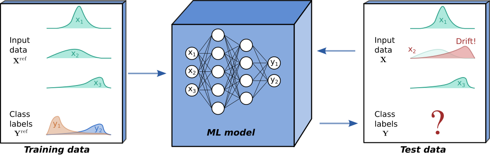
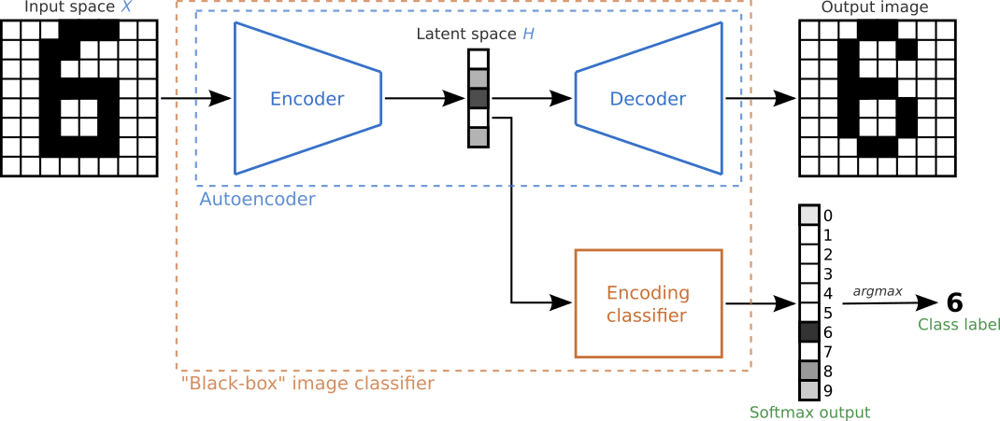

Background
==========

.. contents:: :local:
   :depth: 2

0. What is drift?
-----------------
Although powerful, modern machine learning models can be sensitive.
Seemingly subtle changes in a data distribution can destroy the
performance of otherwise state-of-the art models, which can be
especially problematic when ML models are deployed in production.
Typically, ML models are tested on held out data in order to estimate
their future performance. Crucially, this assumes that the *process*
underlying the input data :math:`\mathbf{X}` and output data
:math:`\mathbf{Y}` remains constant.

*Drift* is said to occur when the process underlying :math:`\mathbf{X}`
and :math:`\mathbf{Y}` at test time differs from the process that
generated the training data. In this case, we can no longer expect the
model’s performance on test data to match that observed on held out
training data. If a *ground truth* is available at test time,
*supervised drift detection* can be performed, with the model’s
predictive performance monitored directly. However, in many scenarios,
such as the binary classification example below, a ground truth is not
available and *unsupervised drift detection* methods are required.

To explore the different types of drift, consider the common scenario
where we have input data :math:`\mathbf{X}` and output data
:math:`\mathbf{Y}`, jointly distributed according to
:math:`P(\mathbf{X},\mathbf{Y})`, and a model
:math:`f: \boldsymbol{x} \mapsto y` trained on training data drawn from
a distribution :math:`P_{ref}(\mathbf{X},\mathbf{Y})`. *Drift* is said
to have occurred when
:math:`P(\mathbf{X},\mathbf{Y}) \ne P_{ref}(\mathbf{X},\mathbf{Y})`.
Writing the joint distribution as

.. math::
   P(\mathbf{X},\mathbf{Y}) = P(\mathbf{Y}|\mathbf{X})P(\mathbf{X}) = P(\mathbf{X}|\mathbf{Y})P(\mathbf{Y}),

we can classify drift under a number of types:

-  **Covariate drift**: Also referred to as input drift, this occurs
   when the distribution of the input data has shifted
   :math:`P(\mathbf{X}) \ne P_{ref}(\mathbf{X})`, whilst
   :math:`P(\mathbf{Y}|\mathbf{X})` =
   :math:`P_{ref}(\mathbf{Y}|\mathbf{X})`. The model may now be
   extrapolating, potentially resulting in unreliable predictions.

-  **Prior drift**: Also referred to as label drift, this occurs when
   the distribution of the outputs has shifted
   :math:`P(\mathbf{Y}) \ne P_{ref}(\mathbf{Y})`, whilst
   :math:`P(\mathbf{X}|\mathbf{Y})=P_{ref}(\mathbf{X}|\mathbf{Y})`. The
   model could still be accurate, but accuracy metrics might be
   affected.

-  **Concept drift**: This occurs when the process generating :math:`y`
   from :math:`x` has changed, such that
   :math:`P(\mathbf{Y}|\mathbf{X}) \ne P_{ref}(\mathbf{Y}|\mathbf{X})`.
   It is possible that the model might no longer give a suitable
   approximation of the true process.

Note that a change in one of the conditional probabilities
:math:`P(\mathbf{X}|\mathbf{Y})` and :math:`P(\mathbf{Y}|\mathbf{X})`
does not necessarily imply a change in the other. For example, consider
the pneumonia prediction example from `Lipton et
al. <https://arxiv.org/pdf/1802.03916.pdf>`__, whereby a classification
model :math:`f` is trained to predict :math:`y`, the occurrence (or not)
of pneumonia, given a list of symptoms :math:`\boldsymbol{x}`. During a
pneumonia outbreak, :math:`P(\mathbf{Y}|\mathbf{X})` (e.g. pneumonia
given cough) might rise, but the manifestations of the disease
:math:`P(\mathbf{X}|\mathbf{Y})` might not change.

Below, the different types of drift are visualised for a simple
two-dimensional classification problem. It is possible for a drift to
fall under more than one category, for example the *prior drift* below
also happens to be a case of *covariate drift*.

It is relatively easy to spot drift by eyeballing these figures here.
However, the task becomes considerably harder for high-dimensional real
problems, especially since real-time ground truths are not typically
available. Some types of drift, such as prior and concept drift, are
also difficult to detect without access to ground truths. As a
workaround proxies are required, for example a model’s predictions can
be monitored to check for prior drift.

1. Detecting drift 
------------------
`Alibi Detect <https://github.com/SeldonIO/alibi-detect>`__ offers a
wide array of methods for detecting drift (see
`here <../overview/algorithms.md>`__), some of which are examined in the
NeurIPS 2019 paper `Failing Loudly: An Empirical Study of Methods for
Detecting Dataset Shift <https://arxiv.org/abs/1810.11953>`__.
Generally, these aim to determine whether the distribution
:math:`P(\mathbf{x})` has drifted from a reference distribution
:math:`P_{ref}(\mathbf{x})`, where :math:`\mathbf{x}` may represent
input data :math:`\mathbf{X}`, true output data :math:`\mathbf{Y}`, or
some form of model output, depending on what type of drift we wish to
detect.

Due to natural randomness in the process being modelled, we don’t
necessarily expect observations :math:`\mathbf{x}_1,\dots,\mathbf{x}_N`
drawn from :math:`P(\mathbf{x})` to be identical to
:math:`\mathbf{x}^{ref}_1,\dots,\mathbf{x}^{ref}_M` drawn from
:math:`P_{ref}(\mathbf{x})`. To decide whether differences between
:math:`P(\mathbf{x})` and :math:`P_{ref}(\mathbf{x})` are due to drift
or just natural randomness in the data, *statistical two-sample
hypothesis* testing is used, with the null hypothesis
:math:`P(\mathbf{x})=P_{ref}(\mathbf{x})`. If the :math:`p`-value
obtained is below a given threshold, the null is rejected and the
alternative hypothesis :math:`P(\mathbf{x}) \ne P_{ref}(\mathbf{x})` is
accepted, suggesting drift is occurring.

Since :math:`\mathbf{x}` is often high-dimensional (even a 200 x 200
greyscale image has 40k dimensions!), performing hypothesis testing in
the full-space is often either computationally intractable, or
unsuitable for the chosen statistical test. Instead, the pipeline below
is often used, with dimension reduction as a pre-processing step.

   *Figure inspired by Figure 1 in Failing Loudly: An Empirical Study
   of Methods for Detecting Dataset Shift.*

Hypothesis testing
~~~~~~~~~~~~~~~~~~
Hypothesis testing involves first choosing a *test statistic*
:math:`S(\mathbf{x})`, which is expected to be small if the null
hypothesis :math:`H_0` is true, and large if the alternative :math:`H_a`
is true. For observed data :math:`\mathbf{x}`, :math:`S(\mathbf{x})` is
computed, followed by a :math:`p`-value
:math:`\hat{p} = P(\text{such an extreme } S(\mathbf{x}) | H_0)`. In
other words, :math:`\hat{p}` represents the probability of such an
extreme value of :math:`S(\mathbf{x})` occurring given that :math:`H_0`
is true. Typically results are said to be *statistically significant*,
and the null :math:`P(\mathbf{x})=P_{ref}(\mathbf{x})` is rejected, when
:math:`\hat{p}\le \alpha`. Conveniently, the threshold :math:`\alpha`
represents the desired false positive rate. The *test statistics* available
in `Alibi Detect <https://github.com/SeldonIO/alibi-detect>`__ can be
broadly split into two categories; univariate and multivariate tests.

-  Univariate:

   -  `Chi-Squared <methods/chisquaredrift.ipynb>`__ (for categorical
      data)
   -  `Kolmogorov-Smirnov <methods/ksdrift.ipynb>`__

-  Multivariate:

   -  `Least-Squares Density Difference
      (LSDD) <methods/lsdddrift.ipynb>`__
   -  `Maximum Mean Discrepancy (MMD) <methods/mmddrift.ipynb>`__

When applied to multidimensional data with dimension :math:`d`, the
univariate tests are applied in a feature-wise manner. The obtained
:math:`p`-values for each feature are aggregated either via the
`Bonferroni <https://mathworld.wolfram.com/BonferroniCorrection.html>`__
or the `False Discovery
Rate <http://www.math.tau.ac.il/~ybenja/MyPapers/benjamini_hochberg1995.pdf>`__
(FDR) correction. The Bonferroni correction is more conservative and
controls for the probability of at least one false positive. The FDR
correction on the other hand allows for an expected fraction of false
positives to occur.

Since the univariate tests examine the feature-wise marginal
distributions, they may miss drift in cases where the joint distribution
over all :math:`d` features has changed, but the marginals have not. The
multivariate tests, which use permutation testing to extract
:math:`p`-values, offer a more powerful alternative at the cost of
greater complexity.

Dimension reduction
~~~~~~~~~~~~~~~~~~~
Given an input dataset :math:`\mathbf{X}\in \mathbb{R}^{N\times d}`,
where :math:`N` is the number of observations and :math:`d` the number
of dimensions, the aim is to reduce the data dimensionality from
:math:`d` to :math:`K`, where :math:`K\ll d`. The lower dimensional data
:math:`\hat{\mathbf{X}}\in \mathbb{R}^{N\times K}` is then monitored by
the drift detector. The paper `Failing Loudly: An Empirical Study of
Methods for Detecting Dataset
Shift <https://arxiv.org/abs/1810.11953>`__ presents a number of
dimension reduction approaches, which can be broadly categorised under:

1. Linear projections
2. Non-linear projections
3. Feature maps (from ML model)

`Alibi Detect <https://github.com/SeldonIO/alibi-detect>`__ allows for a
high degree of flexibility here, with a user’s chosen dimension
reduction technique able to be incorporated into their chosen detector
via the ``preprocess_fn`` argument (and sometimes
``preprocess_batch_fn`` and ``preprocess_x_ref``, depending on the
detector). In the following sections, the three categories of techniques
are briefly introduced. Alibi Detect offers the following functionality
using either `TensorFlow <https://www.tensorflow.org/>`__ or
`PyTorch <https://pytorch.org/>`__ backends and preprocessing utilities.
For more details, see the `examples <examples.rst>`__.

Linear projections
^^^^^^^^^^^^^^^^^^
This includes dimension reduction techniques such as `principal
component analysis
(PCA) <https://en.wikipedia.org/wiki/Principal_component_analysis>`__
and `sparse random projections
(SRP) <https://doi.org/10.1145/1150402.1150436>`__. These techniques
involve using a transformation or projection matrix :math:`\mathbf{R}`
to reduce the dimensionality of a given data matrix :math:`\mathbf{X}`,
such that :math:`\hat{\mathbf{X}} = \mathbf{XR}`. A straightforward way
to include such techniques as a pre-processing stage is to pass them to
the detectors via the ``preprocess_fn`` argument, for example for the
``scikit-learn`` library’s ``PCA`` class:

.. code:: python

   pca = PCA(2)
   pca.fit(X_train)
   detector = MMDDrift(X_ref, backend='tensorflow', p_val=.05, preprocess_fn=pca.transform)

Non-linear projections
^^^^^^^^^^^^^^^^^^^^^^
A common strategy for obtaining non-linear dimension reducing
representations is to use an autoencoder, but other `non-linear
techniques <https://en.wikipedia.org/wiki/Nonlinear_dimensionality_reduction>`__
can also be used. Autoencoders consist of an encoder function
:math:`\phi : \mathcal{X} \mapsto \mathcal{H}` and a decoder function
:math:`\psi : \mathcal{H} \mapsto \mathcal{X}`, where the latent space
:math:`\mathcal{H}` has lower dimensionality than the input space
:math:`\mathcal{X}`. The output of the encoder
:math:`\hat{\mathbf{X}} \in \mathcal{H}` can then be monitored by the
drift detector. Training involves learning both the encoding function
:math:`\phi` and the decoding function :math:`\psi`, in order to reduce
the reconstruction loss, e.g. if MSE is used:
:math:`\phi, \psi = \text{arg} \min_{\phi, \psi}\, \lVert \mathbf{X}-(\phi \circ \psi)\mathbf{X}\rVert^2`.
However, untrained (randomly initialised) autoencoders can also be used.
For an example, a ``pytorch`` autoencoder can be incorporated into a
detector by packaging it as a callable function using
``preprocess_drift`` (from
`alibi_detect.cd.pytorch.preprocess <../api/alibi_detect.cd.pytorch.preprocess.rst>`__)
and ``partial`` (see
`here <https://docs.python.org/3/library/functools.html#functools.partial>`__):

.. code:: python

   encoder_net = torch.nn.Sequential(...)
   preprocess_fn = partial(preprocess_drift, model=encoder_net, batch_size=512)
   detector = MMDDrift(X_ref, backend='pytorch', p_val=.05, preprocess_fn=preprocess_fn)

Feature maps
^^^^^^^^^^^^
Following `Detecting and Correcting for Label Shift with Black Box
Predictors <https://arxiv.org/abs/1802.03916>`__, feature maps can be
extracted from existing pre-trained black-box models such as the image
classifier shown below. Instead of using the latent space as the
dimensionality-reducing representation, other layers of the model such
as the softmax outputs or predicted class-labels can also be extracted
and monitored. Since different layers yield different output dimensions,
different hypothesis tests are required for each.

   *Figure inspired by this MNIST classification example from the
   timeserio package.*

`Failing Loudly: An Empirical Study of Methods for Detecting Dataset
Shift <https://arxiv.org/abs/1810.11953>`__ shows that extracting
feature maps from existing models can be an effective technique, which
is encouraging since this allows the user to repurpose existing
black-box models for use as drift detectors. The syntax for
incorporating existing models into drift detectors is similar to the
previous autoencoder example, with the added step of using
``HiddenOutput``
(`alibi_detect.cd.tensorflow.preprocess <../api/alibi_detect.cd.tensorflow.preprocess.rst>`__
or
`alibi_detect.cd.pytorch.preprocess <../api/alibi_detect.cd.pytorch.preprocess.rst>`__)
to select the model’s network layer to extract outputs from. The code
snippet below is borrowed from `Maximum Mean Discrepancy drift detector
on CIFAR-10 <../examples/cd_mmd_cifar10.ipynb>`__, where the softmax
layer of the well-known
`ResNet-32 <https://arxiv.org/pdf/1512.03385.pdf>`__ model is fed into
an ``MMDDrift`` detector.

.. code:: python

   clf = fetch_tf_model('cifar10', 'resnet32')
   preprocess_fn = partial(preprocess_drift, model=HiddenOutput(clf, layer=-1), batch_size=128)
   detector = MMDDrift(X_ref, backend='tensorflow', p_val=.05,preprocess_fn=preprocess_fn)

.. note::

   **Note 1: Disjoint training and reference data sets**

   Astute readers may have noticed that in the linear projection example
   above, the data ``X_train`` is used to “train” the ``PCA`` model, but
   the ``MMDDrift`` detector is initialised with ``X_ref``. This is a
   subtle yet important point. If a detector’s preprocessor (a
   `dimension reduction <#Dimension-reduction>`__ or other `input
   preprocessing <#Input-preprocessing>`__ step) is trained on the
   reference data (``X_ref``), any over-fitting to this data may make
   the resulting detector overly sensitive to differences between the
   reference and test data sets.

   To avoid an overly discriminative detector, it is customary to draw
   two disjoint datasets from :math:`P_{ref}(\mathbf{x})`, a training
   set and a held-out reference set. **The training data is used to
   train any input preprocessing steps, and the detector is then
   initialised on the reference set**, and used to detect drift between
   the reference and test set. This also applies to the `learned drift
   detectors <#2.-Learned-drift-detection>`__, which should be trained
   on the training set not the reference set.

Input preprocessing
~~~~~~~~~~~~~~~~~~~
Dimension reduction is a common preprocessing task (e.g. for covariate
drift detection on tabular or image data), but some modalities of data
(e.g. text and graph data) require other forms of preprocessing in order
for drift detection to be performed effectively.

Text data
^^^^^^^^^
When dealing with text data, performing drift detection on raw strings
or tokenized data is not effective since they don’t represent the
semantics of the input. Instead, we extract contextual embeddings from
language transformer models and detect drift on those. This procedure
has a significant impact on the type of drift we detect. Strictly
speaking we are not detecting covariate/input drift anymore since the
entire training procedure (objective function, training data etc) for
the (pre)trained embeddings has an impact on the embeddings we extract.

   *Figure based on Jay Alammar’s excellent* \ `visual guide
   <https://jalammar.github.io/a-visual-guide-to-using-bert-for-the-first-time/>`__ \
   *to the BERT model*

Alibi Detect contains functionality to leverage pre-trained embeddings
from HuggingFace’s
`transformer <https://huggingface.co/transformers/>`__ package. Popular
models such as `BERT <https://arxiv.org/abs/1810.04805>`__ or
`DistilBERT <https://arxiv.org/abs/1910.01108>`__ (shown above) can be
used, but Alibi Detect also allows you to easily use your own embeddings
of choice. A subsequent dimension reduction step can also be applied if
necessary, as is done in the `Text drift detection on IMDB movie
reviews <../examples/cd_text_imdb.nblink>`__ example, where the
768-dimensional embeddings from the BERT model are passed through an
untrained AutoEncoder to reduce their dimensionality. Alibi Detect
allows various types of embeddings to be extracted from transformer
models, as discussed in
`alibi_detect.models.tensorflow.embedding <../api/alibi_detect.models.tensorflow.embedding.rst>`__.

Graph data
^^^^^^^^^^
In a similar manner to text data, graph data requires preprocessing
before drift detection can be performed. This can be done by extracting
graph embeddings from graph neural network (GNN) encoders, as shown
below, and demonstrated in the `Drift detection on molecular
graphs <../examples/cd_mol.nblink>`__ example.

Simple example
~~~~~~~~~~~~~~
For a simple example, we’ll use the `MMD
detector <methods/mmddrift.ipynb>`__ to check for drift on the
two-dimensional binary classification problem shown previously. The MMD
detector is a kernel-based method for multivariate two sample testing.
Since the number of dimensions is already low, dimension reduction step
is not necessary here here. For a more advanced example using the `MMD
detector <methods/mmddrift.ipynb>`__ with dimension reduction, check out
the `Maximum Mean Discrepancy drift detector on
CIFAR-10 <../examples/cd_mmd_cifar10.nblink>`__ example.

The true model/process is defined as:

.. math::
   y =
   \begin{cases}
       1 & \text{if } x_2 > sx_1 \\
       0 & \text{otherwise}
   \end{cases}

where the slope :math:`s` is set as :math:`s=-1`.

.. code:: ipython3

    def true_model(X,slope=-1):
        z = slope*X[:,0]
        idx = np.argwhere(X[:,1]>z)
        y = np.zeros(X.shape[0])
        y[idx] = 1
        return y

The 2D input data :math:`\mathbf{x}=(x_1,x_2)` is generated by sampling
from a mixture of two Normal distributions:

.. math::
   \mathbf{x} = \phi_1 \mathcal{N}\left(\left[-1,-1\right]^T, \sigma^2\mathbf{I} \right) +
   \phi_2 \mathcal{N}\left(\left[1,1\right]^T, \sigma^2\mathbf{I} \right)

with the standard deviation set at :math:`\sigma=0.8`, and the weights
set to :math:`\phi_1=\phi_2=0.5`.

.. code:: ipython3

    sigma = 0.8
    ref_norm_0 = stats.multivariate_normal([-1,-1], np.eye(2)*sigma**2)
    ref_norm_1 = stats.multivariate_normal([ 1, 1], np.eye(2)*sigma**2)
    
    X_0 = ref_norm_0.rvs(size=120,random_state=1)
    X_1 = ref_norm_1.rvs(size=120,random_state=1)
    X_ref = np.vstack([X_0, X_1])
    
    true_slope = -1
    y_ref = true_model(X_ref,true_slope)

For our model, we choose the well-known, but simple, decision tree
classifier. As well as training the model, this is a good time to
initialise the MMD detector with held-out reference data (see Note 1) by
calling:

.. code:: python

   detector = MMDDrift(X_ref, backend='tensorflow', p_val=.05)

The significance threshold is set at :math:`\alpha=0.05`, meaning the
detector will flag results as drift detected when the computed
:math:`p`-value is less than this i.e. :math:`\hat{p}< \alpha`.

.. code:: ipython3

    # Generate training data for the classifier.
    X_0 = ref_norm_0.rvs(size=120,random_state=0)
    X_1 = ref_norm_1.rvs(size=120,random_state=0)
    X_train = np.vstack([X_0, X_1])
    y_train = true_model(X_train,true_slope)
    
    # Fit decision tree classifier
    from sklearn.tree import DecisionTreeClassifier
    clf = DecisionTreeClassifier(max_depth=20)
    clf.fit(X_train, y_train)
    
    # Plot with a pre-defined helper function
    plot(X_ref,y_ref,true_slope,clf=clf)
    
    # Classifier accuracy
    print('Mean training accuracy %.2f%%' %(100*clf.score(X_ref,y_ref)))
    
    # Fit a drift detector to the training data
    from alibi_detect.cd import MMDDrift
    detector = MMDDrift(X_ref, backend='pytorch', p_val=.05)

.. parsed-literal::

    Mean training accuracy 99.17%
    No GPU detected, fall back on CPU.

No drift
^^^^^^^^
Before introducing drift, we first examine the case where no drift is
present. We resample from the same mixture of Gaussian distributions to
generate test data. The individual data observations are different, but
the underlying distributions are unchanged, hence no true drift is
present.

.. code:: ipython3

    slope = true_slope
    
    X_0 = ref_norm_0.rvs(size=60,random_state=2)
    X_1 = ref_norm_1.rvs(size=60,random_state=2)
    X_test = np.vstack([X_0, X_1])
    
    # Plot
    y_test = true_model(X_test,slope)
    plot(X_test,y_test,slope,clf=clf)
    
    # Classifier accuracy
    print('Mean test accuracy %.2f%%' %(100*clf.score(X_test,y_test)))

.. parsed-literal::

    Mean test accuracy 95.00%

Unsurprisingly, the model’s mean test accuracy is relatively high. To
run the detector on test data the ``.predict()`` is used:

.. code:: ipython3

    detector.predict(X_test)

.. parsed-literal::

    {'data': {'is_drift': 0,
      'distance': 0.0023595122654528344,
      'p_val': 0.30000001192092896,
      'threshold': 0.05,
      'distance_threshold': 0.008109889},
     'meta': {'name': 'MMDDriftTorch',
      'detector_type': 'offline',
      'data_type': None,
      'backend': 'pytorch'}}

For the test statistic :math:`S(\mathbf{x})`, the MMD detector uses the
`kernel trick <https://en.wikipedia.org/wiki/Kernel_method>`__ to
compute unbiased estimates of :math:`\text{MMD}^2`. The
:math:`\text{MMD}` is a distance-based measure between the two
distributions :math:`P` and :math:`P_{ref}`, based on the mean
embeddings :math:`\mu` and :math:`\mu_{ref}` in a reproducing kernel
Hilbert space :math:`F`:

.. math::
   \text{MMD}^2\left(F, P, P_{ref}\right) = \lVert \mu - \mu_{ref} \rVert^2_{F}

A :math:`p`-value is then obtained via a `permutation
test <https://en.wikipedia.org/wiki/Resampling_(statistics)>`__ on the
values of :math:`\text{MMD}^2`. As expected, since we are sampling from
the reference distribution :math:`P_{ref}(\mathbf{x})`, the detector’s
prediction is ``'is_drift':0`` here, indicating that drift is not
detected. More specifically, the detector’s :math:`p`-value (``p_val``)
is above the threshold of :math:`\alpha=0.05` (``threshold``),
indicating that no statistically significant drift has been detected.
The ``.predict()`` method also returns :math:`\hat{S}(\mathbf{x})`
(``distance_threshold``), which is the threshold in terms of the test
statistic :math:`S(\mathbf{x})` i.e. when
:math:`S(\mathbf{x})\ge \hat{S}(\mathbf{x})` statistically significant
drift has been detected.

Covariate and prior drift
^^^^^^^^^^^^^^^^^^^^^^^^^
To impose covariate drift, we apply a shift to the mean of one of the
normal distributions:

.. math::
   \mathbf{x}^* = \phi_1 \mathcal{N}\left(\left[-1\color{red}{+3},-1\color{red}{-3}\right]^T, \sigma^2\mathbf{I} \right) +
   \phi_2 \mathcal{N}\left(\left[1,1\right]^T, \sigma^2\mathbf{I} \right)

.. code:: ipython3

    slope = -1.0
    
    shift_norm_0 = stats.multivariate_normal([2, -4], np.eye(2)*sigma**2)
    X_0 = shift_norm_0.rvs(size=60,random_state=2)
    X_1 = ref_norm_1.rvs(size=60,random_state=2)
    X_test = np.vstack([X_0, X_1])
    
    # Plot
    y_test = true_model(X_test,slope)
    plot(X_test,y_test,slope,clf=clf)
    
    # Classifier accuracy
    print('Mean test accuracy %.2f%%' %(100*clf.score(X_test,y_test)))
    
    # Check for drift in covariates
    pred = detector.predict(X_test)
    labels = ['No','Yes']
    print('Is drift? %s!' %labels[pred['data']['is_drift']])

.. parsed-literal::

    Mean test accuracy 66.67%
    Is drift? Yes!

The test data has drifted into a previously unseen region of feature
space, and the model is now misclassifying a number of test
observations. If true test labels are available, this is easily
detectable by monitoring the test accuracy. However, labels are not
always available at test time, in which case a drift detector monitoring
the covariates comes in handy. In this case, the MMD detector
successfully detects the covariate drift.

In a similar manner, a proxy for prior drift can be monitored by
initialising a detector on labels from the reference set, and then
feeding it a model’s predicted labels:

.. code:: python

   label_detector = MMDDrift(y_ref.reshape(-1,1), backend='tensorflow', p_val=.05)
   y_pred = clf.predict(X_test)
   label_detector.predict(y_pred.reshape(-1,1))

2. Learned drift detection
--------------------------

The detectors discussed elsewhere in this page can be considered as
*unlearned detectors*, in the sense that they don’t need to *learn* by
training against a training data set (they are only
calibrated/configured against a reference set). However, Alibi Detect
also offers a number of learned detectors:

-  `Learned kernel <methods/learnedkerneldrift.ipynb>`__
-  `Classifier <methods/classifierdrift.ipynb>`__
-  `Spot-the-diff <methods/spotthediffdrift.ipynb>`__\ (erence)
-  `Model uncertainty <methods/modeluncdrift.ipynb>`__

These detectors can be highly effective, but require training hence
potentially increasing data requirements and set-up time. Similarly to
when training preprocessing steps, **it is important that the learned
detectors are trained on training data which is held-out from the
reference data set** (see Note 1). A brief overview of these detectors
is given below. For more details, see the detectors’ respective pages.

Learned kernel
~~~~~~~~~~~~~~

The `MMD detector <methods/mmddrift.ipynb>`__ uses a kernel
:math:`k(\mathbf{x},\mathbf{x}')` to compute unbiased estimates of
:math:`\text{MMD}^2`. The user is free to provide their own kernel, but by default a `Gaussian
RBF kernel <https://en.wikipedia.org/wiki/Radial_basis_function_kernel>`__
is used. The `Learned kernel <methods/learnedkerneldrift.ipynb>`__ drift
detector (`Liu et al., 2020 <https://arxiv.org/pdf/2002.09116.pdf>`__)
extends this approach by training a kernel to maximise an estimate of
the resulting test power. The learned kernel is defined as

.. math::
   k(\mathbf{x},\mathbf{x}') = \left(1-\epsilon\right)\, k_a\!\left(\Phi(\mathbf{x}),\Phi(\mathbf{x}') \right) +
   \epsilon \, k_b\!\left(\mathbf{x},\mathbf{x}'\right),

where :math:`\Phi` is a learnable projection, :math:`k_a` and
:math:`k_b` are simple characteristic kernels (such as a Gaussian RBF),
and :math:`\epsilon>0` is a small constant. By letting :math:`\Phi` be
very flexible we can learn powerful kernels in this manner.

The figure below compares the use of a Gaussian and a learned kernel for
identifying differences between two distributions :math:`P` and
:math:`P_{ref}`. The distributions are each equal mixtures of nine
Gaussians with the same modes,but each component of :math:`P_{ref}` is
an isotropic Gaussian, whereas the covariance of :math:`P` differs in
each component. The Gaussian kernel (c) treats points isotropically
throughout the space, based upon
:math:`\lVert \mathbf{x} - \mathbf{x}^{ref} \rVert` only. The learned
kernel (d) behaves differently in different regions of the space,
adapting to local structure and therefore allowing better detection of
differences between :math:`P` and :math:`P_{ref}`.

   *Original image source: Liu et al., 2020. Captions
   modified to match notation used elsewhere on this page.*

Classifier
~~~~~~~~~~
The `classifier <methods/classifierdrift.ipynb>`__-based drift detector
(`Lopez-Paz and Oquab, 2017 <https://arxiv.org/abs/1610.06545>`__)
attempts to detect drift by explicitly training a classifier to
discriminate between data from the reference and test sets. The
statistical test used depends on whether the classifier outputs
probabilities or binarized (0 or 1) predictions, but the general idea is
to determine whether the classifiers performance is statistically
different from random chance. If the classifier can learn to
discriminate better than randomly (in a generalisable manner) then drift
must have occurred.

`Liu et al. <https://arxiv.org/pdf/2002.09116.pdf>`__ show that a
classifier-based drift detector is actually a special case of the
`learned kernel <#Learned-kernel>`__. An important difference is that to
train a classifier we maximise its accuracy (or a cross-entropy proxy),
while for a learned kernel we maximise the test power directly. Liu et
al. show that the latter approach is empirically superior.

Spot-the-diff
~~~~~~~~~~~~~
The `spot-the-diff <methods/spotthediffdrift.ipynb>`__\ (erence) drift
detector is an extension of the
`Classifier <methods/classifierdrift.ipynb>`__ drift detector, where the
classifier is specified in a manner that makes detections interpretable
at the feature level when they occur. The detector is inspired by the
work of `Jitkrittum et al. (2016) <https://arxiv.org/abs/1605.06796>`__
but various major adaptations have been made.

As with the usual classifier-based approach, a portion of the available
data is used to train a classifier that can discriminate reference
instances from test instances. However, the spot-the-diff detector is
specified such that when drift is detected, we can inspect the weights
of the classifier to shine light on exactly which features of the data
were used to distinguish reference from test samples, and therefore
caused drift to be detected. The `Interpretable drift detection with the
spot-the-diff detector on MNIST and Wine-Quality
datasets <../examples/cd_spot_the_diff_mnist_wine.nblink>`__ example
demonstrates this capability.

Model uncertainty
~~~~~~~~~~~~~~~~~
The `model uncertainty <methods/modeluncdrift.ipynb>`__-based drift
detector uses the ML model of interest itself to detect drift. It
doesn’t fit as neatly under the category of *learned detectors*, since
unlike the others, it does not require an additional detector/model to be
trained. Nevertheless, it is included in this category since, like the
other learned detectors, it is important that the reference data set
given to the detector is disjoint from the training set used to train
the model of interest.

Model-uncertainty drift detectors aim to directly detect drift that’s
likely to effect the performance of a model of interest. The approach is
to test for change in the number of instances falling into regions of
the input space on which the model is uncertain in its predictions. For
each instance in the reference set the detector obtains the model’s
prediction and some associated notion of uncertainty. The same is done
for the test set and if significant differences in uncertainty are
detected (via a Kolmogorov-Smirnoff test) then drift is flagged. The
model’s notion of uncertainty depends on the type of model. For a
classifier this may be the entropy of the predicted label probabilities.
For a regressor with dropout layers, `dropout Monte
Carlo <http://proceedings.mlr.press/v48/gal16.pdf>`__ can be used to
provide a notion of uncertainty.

3. Online drift detection
-------------------------
So far, we have discussed drift detection in an *offline* context, with
the entire test set :math:`\{\mathbf{X}_i\}_{i=1}^{N}` compared to the
reference dataset :math:`\{\mathbf{X}^{ref}_i\}_{i=1}^{M}`. However, at
test time data sometimes arrives sequentially, meaning drift detection
must be performed in an *online* fashion.

.. image:: images/online.*
   :alt: Online drift detection
   :align: center
   :width: 350px

One approach is to perform a test for drift every :math:`W` time-steps,
using the :math:`W` samples that have arrived since the last test. In
other words, that is to compare :math:`\{\mathbf{X}_i\}_{i=t}^{t+W}` to
:math:`\{\mathbf{X}^{ref}_i\}_{i=1}^{M}`. Such a strategy could be
implemented using any of the offline detectors implemented in
alibi-detect, but being both sensitive to slight drift and responsive to
severe drift is difficult. If the window size :math:`W` is too large the
delay between consecutive statistical tests hampers responsiveness to
severe drift, but an overly small window is unreliable. This is
demonstrated below, where the offline `MMD
detector <methods/mmddrift.ipynb>`__ is used to monitor drift in data
sampled from a normal distribution
:math:`\mathcal{N}\left(\mu,\sigma^2 \right)`, with the mean starting to
drift from :math:`\mu=0` to :math:`\mu=0.5` at :math:`t=40`.

.. image:: images/offline_drift_W2.*
   :alt: Offline detector with W=2
   :align: center
   :width: 700px
.. image:: images/offline_drift_W20.*
   :alt: Offline detector with W=20
   :align: center
   :width: 700px

Online drift detectors
~~~~~~~~~~~~~~~~~~~~~~
An alternative strategy is to perform a test each time data arrives.
However the usual offline methods are not applicable because the process
for computing :math:`p`-values is too expensive. Additionally, they
don’t account for correlated test outcomes when using overlapping
windows of test data, leading to miscalibrated detectors operating at an
unknown False Positive Rate (FPR). Well-calibrated FPR’s are crucial for
judging the severity of a drift detection. In the absence of
calibration, drift detection can be useless since there is no way of
knowing what fraction of detections are false positives. `Alibi
Detect <https://github.com/SeldonIO/alibi-detect>`__ offers specialist
online drift detectors, which are designed to be well-calibrated when
used sequentially:

-  `Online Maximum Mean Discrepancy <methods/onlinemmddrift.ipynb>`__
-  `Online Least-Squares Density
   Difference <methods/onlinelsdddrift.ipynb>`__

Thoughtful structuring of the computations reduces the cost of these
detectors from :math:`O(N^2B)` to :math:`O(N^2 + NB)` during
configuration (where :math:`B` is the number of bootstrap samples used
for calibration), and from :math:`O(N^2)` to :math:`O(N)` during
operation. The detectors compute a test statistic :math:`S(\mathbf{x})`
during the configuration phase. Then, at test time, the test statistic
is updated sequentially at a low cost. When no drift has occurred the
test statistic fluctuates around its expected value, and once drift
occurs the test statistic starts to drift upwards. When it exceeds some
preconfigured threshold value, drift is detected. The online detectors
are constructed in a similar manner to the offline detectors, for
example for the online MMD detector:

.. code:: python

   online_detector = MMDDriftOnline(X_ref, ert, window_size, backend='tensorflow', n_bootstraps=5000)

But, in addition to providing the detector with reference data, the
expected run-time (see below), and size of the sliding window must also
be defined. Another important difference is that the online detectors
make predictions on single data instances:

.. code:: python

   result = online_detector.predict(X[i])

This can be seen in the animation below, where the online detector
considers each incoming observation/sample individually, instead of
considering a batch of observations like the offline detectors.

.. image:: images/online_drift.*
   :alt: Online detector
   :align: center
   :width: 700px

Expected run-time and detection delay
~~~~~~~~~~~~~~~~~~~~~~~~~~~~~~~~~~~~~
Unlike offline detectors which require the specification of a threshold
:math:`p`-value, which is equivalent to a false positive rate (FPR), the
online detectors in alibi-detect require the specification of an
expected run-time (ERT) (an inverted FPR). This is the number of
time-steps that we insist our detectors, on average, should run for in
the absence of drift, before making a false detection.

Usually we would like the ERT to be large, however this results in
insensitive detectors which are slow to respond when drift does occur.
Hence, there is a tradeoff between the expected run time and the
expected detection delay (the time taken for the detector to respond to
drift in the data). To target the desired ERT, thresholds are configured
during an initial configuration phase via simulation (``n_bootstraps``
sets the number of boostrap simulations used here). This configuration
process is only suitable when the amount of reference data is relatively
large (ideally around an order of magnitude larger than the desired
ERT). Configuration can be expensive (less so with a GPU), but allows
the detector to operate at a low-cost at test time. For a more in-depth
explanation, see `Drift Detection: An Introduction with
Seldon <https://www.youtube.com/watch?v=JaPMFf0cKlM>`__.
